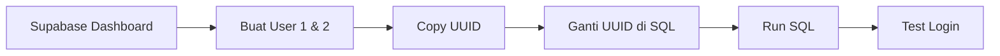

# 🚀 QUICK START - Setup 2 User Owner

## TL;DR (Too Long Didn't Read)

```bash
# 1️⃣ Buka Supabase Dashboard
https://supabase.com/dashboard/project/gnqunygpkdelaadvuifn

# 2️⃣ Buat 2 user di Authentication > Users
Email: barberdoc@mail.com | Password: barberdoc123 | ✅ Auto Confirm
Email: barberdocmalayu@mail.com | Password: malayudoc123 | ✅ Auto Confirm

# 3️⃣ Copy UUID masing-masing user (dari kolom ID)

# 4️⃣ Buka SQL Editor, copy file INSERT_PROFILES_ROLES_OUTLETS.sql

# 5️⃣ Ganti <UUID_USER_1> dan <UUID_USER_2> dengan UUID yang Anda copy

# 6️⃣ Run SQL

# 7️⃣ Test login di http://localhost:8080/auth
```

---

## ⚠️ KENAPA TIDAK BISA INSERT LANGSUNG KE auth.users?

**Error yang muncul:**
```
ERROR: 23503: insert or update on table "user_roles" violates foreign key constraint
Key (user_id)=(9153d76c-d15e-4e25-9c21-6e0447d4e77f) is not present in table "users"
```

**Penyebab:**
- Tabel `auth.users` adalah sistem internal Supabase
- Password harus di-hash dengan bcrypt secara otomatis
- Foreign key `profiles.user_id` → `auth.users.id`
- Foreign key `user_roles.user_id` → `auth.users.id`
- **User belum ada di `auth.users`**, maka insert ke `profiles` dan `user_roles` gagal!

**Solusi:**
- Buat user dulu via **Supabase Dashboard** (otomatis masuk ke `auth.users`)
- Baru insert ke `profiles`, `user_roles`, dan `user_outlets` (pakai UUID user yang baru dibuat)

---

## 📁 FILE YANG SUDAH DIBUAT

| File | Fungsi |
|------|--------|
| `CARA_BUAT_USER_OWNER.md` | 📚 Dokumentasi lengkap step-by-step |
| `INSERT_PROFILES_ROLES_OUTLETS.sql` | 🚀 Template SQL siap pakai (tinggal ganti UUID) |
| `QUICK_START_USER_SETUP.md` | ⚡ File ini - quick reference |

---

## 🎯 URUTAN YANG BENAR



1. **Dashboard** → Buat user (masuk ke `auth.users`)
2. **Copy UUID** → dari kolom "ID" di list user
3. **SQL Editor** → Insert profiles, roles, outlets (pakai UUID tadi)
4. **Test Login** → http://localhost:8080/auth

---

## 🔐 CREDENTIALS HASIL AKHIR

| User | Email | Password | Role | Outlet |
|------|-------|----------|------|--------|
| 1 | barberdoc@mail.com | barberdoc123 | owner | BarberDoc Hampor |
| 2 | barberdocmalayu@mail.com | malayudoc123 | owner | BarberDoc Cabang Malayu |

---

## ✅ CHECKLIST

- [ ] User 1 dibuat via Dashboard
- [ ] User 2 dibuat via Dashboard
- [ ] UUID user 1 sudah dicopy
- [ ] UUID user 2 sudah dicopy
- [ ] SQL sudah diganti UUID-nya
- [ ] SQL sudah dijalankan tanpa error
- [ ] Test login user 1 berhasil
- [ ] Test login user 2 berhasil
- [ ] Menu Settings bisa diakses
- [ ] Ganti password berhasil

---

## 🛠️ TROUBLESHOOTING CEPAT

| Error | Solusi |
|-------|--------|
| `user_id not present in table users` | User belum dibuat di Dashboard → buat dulu |
| `User already exists` | Email sudah ada → hapus user lama atau ganti email |
| `Cannot login` | Auto Confirm tidak dicentang → confirm manual di Dashboard |
| `No role/outlet` | SQL belum dijalankan → run INSERT_PROFILES_ROLES_OUTLETS.sql |

---

## 📞 BUTUH BANTUAN?

Baca dokumentasi lengkap: `supabase/CARA_BUAT_USER_OWNER.md`

**Happy Setup! 🎉**
